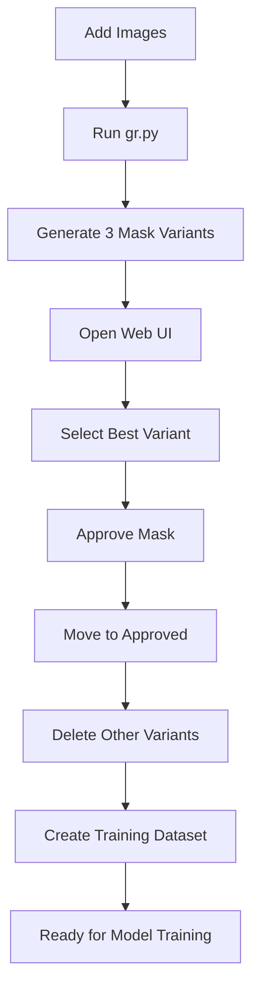

# 🎯 SAM2-Powered Rim Segmentation System

**Semi-automated data generation and custom model training for vehicle rim segmentation**

[](https://www.python.org/downloads/)
[](https://pytorch.org/)
[](https://opensource.org/licenses/MIT)

This project automates the process of detecting, masking, and preparing datasets for vehicle rim segmentation model training using SAM2 (Segment Anything Model 2) and classical computer vision techniques.

## 🚀 Key Features

### ✅ 1. Automated Rim Detection (`gr.py`)
- **SAM2 Integration**: Leverages Meta's SAM2 model for powerful segmentation
- **Incremental Processing**: Only processes new images, preserving existing data
- **Auto-numbering**: Automatically numbers new images (1, 2, 3...)
- **3 Mask Variants**:
  - `Coarse`: Direct SAM2 mask (fast, general-purpose)
  - `Hough`: Hough Circle Transform (ideal for perfect circular rims)
  - `Refined`: ROI-based SAM2 refinement (optimized circularity + area balance)

### ✅ 2. Modern Web Interface (`flask_ui.py`)
- **Clean Design**: Simple and user-friendly interface
- **Smart Selection System**: Easy variant selection with preview
- **Auto-cleanup**: Unapproved variants are automatically deleted
- **Real-time Statistics**: Live progress tracking

### ✅ 3. Professional Dataset Management
- **Approved Masks**: Automatically moved to approved folder
- **Training Formats**: YOLO + COCO format annotations
- **Clean Data Guarantee**: Only approved data included in final dataset

## 🔧 Quick Setup

```bash
# Clone the repository
git clone https://github.com/lmelkorl/sam2-rim-segmentation.git
cd sam2-rim-segmentation

# Run automated setup
chmod +x setup.sh
./setup.sh

# Or manual setup
pip install -r requirements.txt
cd sam2 && pip install -e . && cd ..
```

## 📁 Project Structure

```
rim_dataset/
├── images/train/           # Original images (1.jpg, 2.jpg, ...)
├── crops/train/            # Cropped rims (temporary)
├── masks/train/            # 3 mask variants (temporary)
├── labels/train/           # YOLO format labels
├── approved/               # Approved data
│   ├── images/             # Approved cropped images
│   ├── masks/              # Approved masks
│   └── labels/             # Approved labels
└── final/                  # Ready dataset for model training
    ├── images/             # Final images
    ├── masks/              # Final masks
    ├── annotations/        # YOLO + COCO annotations
    ├── dataset.yaml        # YOLO config
    └── dataset_info.json   # Dataset metadata
```

## 🚀 Usage

### Step 1: Rim Detection and Masking
```bash
# Add vehicle images to rim_dataset/images/train/ folder
python gr.py
```

**Output:**
- 3 different mask variants created for each rim
- YOLO format labels automatically generated
- Only new images processed (incremental)

### Step 2: Web UI Selection
```bash
python flask_ui.py
# Visit http://localhost:5005
```

**Process:**
1. **Variant Selection**: Choose the best mask variant for each rim
2. **Approval**: Approve your selected mask
3. **Auto-cleanup**: Other variants automatically deleted
4. **Move to Approved**: Approved data moved to separate folder

### Step 3: Training Dataset Creation
Click "Training Dataset" button in Web UI.

**Generated Files:**
- `dataset.yaml`: YOLO config file
- `annotations.json`: COCO format annotations
- `*.txt`: YOLO segmentation annotation for each image
- `dataset_info.json`: Dataset metadata

## 🛠️ Installation

### Prerequisites
- Python 3.8+
- PyTorch 2.0+
- CUDA (optional, for GPU acceleration)

### Automated Installation
```bash
./setup.sh
```

### Manual Installation
```bash
pip install -r requirements.txt
cd sam2 && pip install -e . && cd ..
```

**Download SAM2 Checkpoints:**
```bash
cd checkpoints/
wget https://dl.fbaipublicfiles.com/segment_anything_2/092824/sam2.1_hiera_large.pt
wget https://dl.fbaipublicfiles.com/segment_anything_2/092824/sam2.1_hiera_base_plus.pt
```

## 📊 Model Training

### Train Custom Model
```bash
python train_crop_model.py
```

### Test Trained Model
```bash
python web_test_app.py
# Visit http://localhost:5006
```

**Testing Modes:**
- **Full Car**: Step1 (wheel detection) + Step2 (rim segmentation)
- **Crop Only**: Direct rim segmentation on pre-cropped images
- **Batch Mode**: Process multiple images at once
- **Auto Mode**: Automatically determines the best detection type

## 📊 Supported Model Formats

### YOLO Segmentation
```yaml
# dataset.yaml
path: /path/to/final/dataset
train: images
val: images
nc: 1
names: ['rim']
```

### COCO Format
```json
{
  "images": [...],
  "annotations": [...],
  "categories": [{"id": 1, "name": "rim"}]
}
```

## 🔄 Workflow



## 📈 Performance Metrics

**Dataset Statistics:**
- 200 rim samples from 172 vehicle images
- Variant selection distribution:
  - Hough Circle: 58.5% (most preferred)
  - Coarse SAM2: 23.5%
  - Manual correction: 14.5%
  - ROI Refined: 3.5%

**Model Performance (YOLOv8m-seg):**
- Box mAP@50: 99.5%
- Box mAP@50-95: 84.5%
- Mask mAP@50: 99.5%
- Mask mAP@50-95: 86.4%

## 🎯 Variant Selection Guide

### Coarse SAM2 (Red)
- **When to use**: General purpose, fast results
- **Advantages**: Fast, SAM2's natural power
- **Disadvantages**: May select excessive area

### Hough Circle (Green)
- **When to use**: Perfect circular rims
- **Advantages**: Very clean geometric circles
- **Disadvantages**: Fails on elliptical or damaged rims

### ROI Refined (Blue)
- **When to use**: When highest quality is needed
- **Advantages**: Optimized circularity and area balance
- **Disadvantages**: Higher computational cost

## 📈 Performance Tips

1. **Image Quality**: Use high-resolution, clear images
2. **Diversity**: Add different angles, lighting conditions, rim types
3. **Quality Control**: Only approve high-quality masks
4. **Balance**: Select examples from each variant type

## 🔧 Troubleshooting

### SAM2 Model Loading Error
```bash
# Check config path
export PYTHONPATH=/path/to/sam2:$PYTHONPATH
```

### Flask UI Image Loading Issue
```bash
# Check file permissions
chmod -R 755 rim_dataset/
```

### Low Mask Quality
- Increase image quality
- Try different variants
- Prefer ROI Refined variant

## 🤝 Contributing

We welcome contributions! Please see our [Contributing Guidelines](CONTRIBUTING.md) for details.

1. Fork the repository
2. Create a feature branch
3. Commit your changes
4. Create a Pull Request

## 📄 License

This project is licensed under the MIT License - see the [LICENSE](LICENSE) file for details.

## 🙏 Acknowledgments

- **Meta AI**: SAM2 model
- **OpenCV**: Computer vision operations
- **Flask**: Web framework
- **Ultralytics**: YOLO implementation

## 📚 Citation

If you use this work in your research, please cite:

```bibtex
@article{sam2_rim_segmentation_2024,
  title={SAM2-Powered Semi-Automated Data Generation for Vehicle Rim Segmentation},
  author={lmelkorl},
  year={2025},
  journal={GitHub Repository},
  url={https://github.com/lmelkorl/sam2-rim-segmentation}
}
```

## 📄 Papers

- **English**: [paper_en.md](paper_en.md)
- **Türkçe**: [paper_tr.md](paper_tr.md)

## 🔗 Related Projects

- [SAM2: Segment Anything in Images and Videos](https://github.com/facebookresearch/sam2)
- [Ultralytics YOLO](https://github.com/ultralytics/ultralytics)
- [OpenCV](https://opencv.org/)

---

**⭐ If you find this project helpful, please give it a star!** 